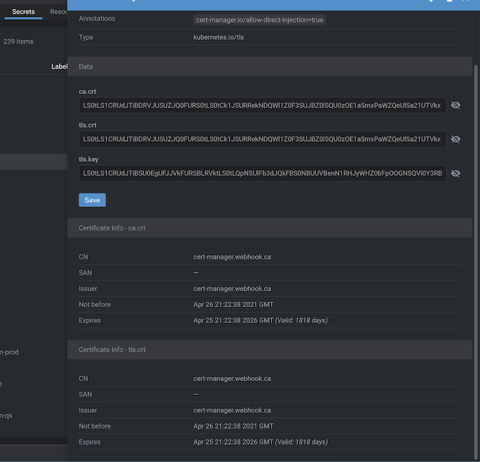

# lens-extension-certificate-info

x

See expire date from certificates inside kubernetes secrets.

Only PEM formatted single certificated are supported yet.

Pull request for more supported formats like Java Keystore, PKCS#12 are welcome.

## Compatibility

| Version                                                | Extension Version |
|--------------------------------------------------------|-------------------|
| [OpenLens](https://github.com/MuhammedKalkan/OpenLens) | <3                |
| [FreeLens](https://github.com/freelensapp/freelens)    | >=4               |

## Installation

### Direct link to Lens

[lens://app/extensions/install/lens-certificate-info](lens://app/extensions/install/lens-certificate-info)

### Manual installation

Menu > Extensions and search for `lens-certificate-info`.

### Alternatives downloads

#### Github

[https://github.com/jkroepke/lens-extension-certificate-info/releases/latest/download/lens-certificate-info.tgz](https://github.com/jkroepke/lens-extension-certificate-info/releases/latest/download/lens-certificate-info.tgz)

#### NPM

[https://registry.npmjs.org/lens-certificate-info/-/lens-certificate-info-$VERSION.tgz](https://registry.npmjs.org/lens-certificate-info/-/lens-certificate-info-$VERSION.tgz)

Replace `$VERSION` with a real version like `1.1.2`.
